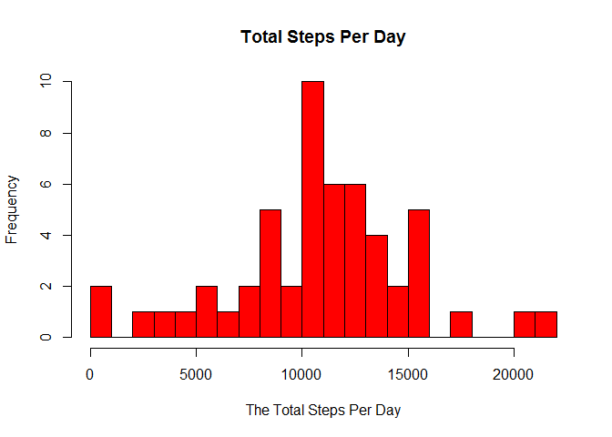
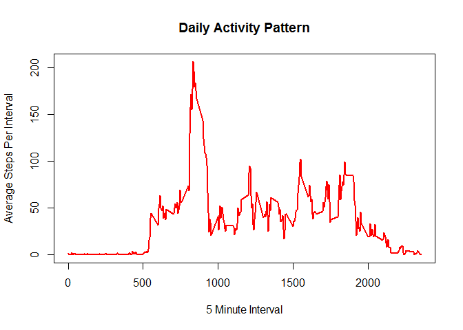
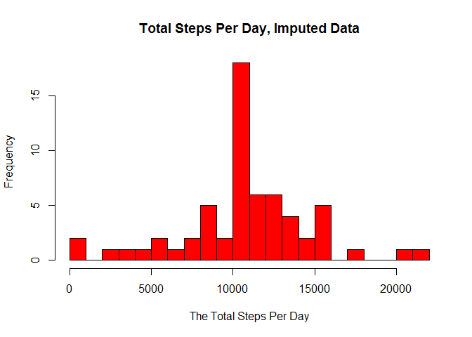
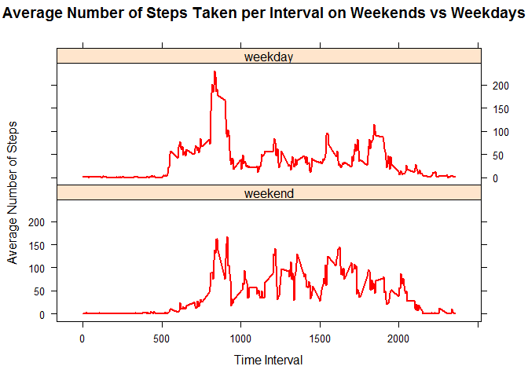

# Reproducible Research: Peer Assessment 1

This R Markdown document was created for Peer Assignment 1 for the COursera class Reproducible Research. 

## Loading and preprocessing the data

The folloowing code will read the data from the working directory and set the data type for each column


```r
activity <- read.csv("activity.csv", header=TRUE)
activity$steps <- as.numeric(activity$steps)
activity$date <- as.Date(activity$date)
activity$interval <- as.numeric(activity$interval)
```

Next, we will get the first few rows of the data


```r
head(activity)
```

```
##   steps       date interval
## 1    NA 2012-10-01        0
## 2    NA 2012-10-01        5
## 3    NA 2012-10-01       10
## 4    NA 2012-10-01       15
## 5    NA 2012-10-01       20
## 6    NA 2012-10-01       25
```

***
## What is mean total number of steps taken per day?

To calculate the mean total number of steps taken per day we first must find the total steps taken per day. We must also make sure to remove "NA" values before we can calculate the sum. This code chuck will calculate the steps per day and output the head of the new dataset which includes the total steps per day.


```r
steps_per_day <- tapply(na.omit(activity)$steps, list(na.omit(activity)$date), sum)
head(steps_per_day)
```

```
## 2012-10-02 2012-10-03 2012-10-04 2012-10-05 2012-10-06 2012-10-07 
##        126      11352      12116      13294      15420      11015
```

Create a simple histogram of the total steps taken per day.


```r
hist(steps_per_day, breaks=25, col="red", main="Total Steps Per Day", xlab="The Total Steps Per Day", ylab="Frequency")
```

 

Find the mean and median of steps per day. Ignore missing values.   


```r
mean(steps_per_day, na.rm=TRUE)
```

```
## [1] 10766.19
```

```r
median(steps_per_day, na.rm=TRUE)
```

```
## [1] 10765
```

***
## What is the average daily activity pattern?

The following code gets the average steps per interval and outputs the first few rows of the data.


```r
steps_per_interval <- tapply(na.omit(activity)$steps, list(na.omit(activity)$interval), mean)
head(steps_per_interval)
```

```
##         0         5        10        15        20        25 
## 1.7169811 0.3396226 0.1320755 0.1509434 0.0754717 2.0943396
```

The following code will make a time series plot of the 5 minute interval and average number of steps taken averaged across all days.


```r
plot(names(steps_per_interval), steps_per_interval, type="l", main="Daily Activity Pattern", xlab="5 Minute Interval", ylab="Average Steps Per Interval", col="red", lwd=2)
```

 

The following code will determine which 5-minute interval contains the highest number of steps


```r
highest_steps <- which.max(steps_per_interval)
names(highest_steps)
```

```
## [1] "835"
```

***
## Imputing missing values

Now we will create a new dataset that will fill in missing datapoints with the average steps taken per interval where data is missing. First we will report the total number of missing values from the original dataset.


```r
sum(complete.cases(activity)==FALSE)
```

```
## [1] 2304
```

The following code will create a new dataset and replace the missing number of steps with the average number of steps for each interval. 


```r
#Create new dataset to be filled and get the interval levels for use with for loop
complete_activity <- activity
count <- as.numeric(levels(factor(complete_activity$interval)))

#Fill in the number of steps for 5-min intervals (using previously calculated steps_per_interval means) with missing values using a for loop
for (i in count) {
  complete_activity[is.na(complete_activity$steps) & complete_activity$interval==i, 1] <- steps_per_interval[names(steps_per_interval)==i][[1]]
} 
```

Now we will create new vector of intervals, using the newly imputed data, using tapply just as we did before.


```r
complete_steps_per_interval <- tapply(complete_activity$steps, list(complete_activity$date), sum)
```

Next, the following code will create a histogram of the total number of steps taken each day for the newly imputed data. 


```r
hist(complete_steps_per_interval, breaks=25, col="red", main="Total Steps Per Day, Imputed Data", xlab="The Total Steps Per Day", ylab="Frequency")
```

 

We can see that the shape of the data did not appear to change. However, the frequency did seem to increase quite a bit compated to the previous dataset. 

To get a more exact overview of the data we will calculate the new mean and median.


```r
mean(complete_steps_per_interval)
```

```
## [1] 10766.19
```

```r
median(complete_steps_per_interval)
```

```
## [1] 10766.19
```

Median increased slightly compared to the previous dataset, but changes overall were very negligible. 

***
## Are there differences in activity patterns between weekdays and weekends?

We will create a new variable in the dataset to represent a weekday or a weekend day. 


```r
#find the days that are weekdays and label them as either weekday or weekend (assigning true or false)
complete_activity <- data.frame(complete_activity, weekday=FALSE)
weekdays <- weekdays(as.Date(complete_activity$date)) %in% c("Monday", "Tuesday", "Wednesday", "Thursday", "Friday")
complete_activity[weekdays, ]$weekday <- TRUE
```

How many weekdays are in the new dataset?


```r
sum(complete_activity$weekday == TRUE)
```

```
## [1] 12960
```

How many weekends are in the new dataset?


```r
sum(complete_activity$weekday == FALSE)
```

```
## [1] 4608
```

Reshape the data so that it is not as noisy and show the first few rows of the newly reshapred dataset. Also, change TRUE and FALSE values for weekday to either "weekday" or "weekend"


```r
steps_by_int_week <- tapply(complete_activity$steps, list(complete_activity$interval, complete_activity$weekday), mean)

library(reshape2)
steps_by_int_week <- melt(steps_by_int_week, varnames=c("int", "weekday"))
steps_by_int_week$weekday <- factor(steps_by_int_week$weekday, labels=c("weekend", "weekday"))
head(steps_by_int_week)
```

```
##   int weekday       value
## 1   0 weekend 0.214622642
## 2   5 weekend 0.042452830
## 3  10 weekend 0.016509434
## 4  15 weekend 0.018867925
## 5  20 weekend 0.009433962
## 6  25 weekend 3.511792453
```

Create a plot containing a time series comparing weekday or weekend data in the new complete dataset. 


```r
library(lattice)
xyplot(steps_by_int_week$value ~ steps_by_int_week$int | steps_by_int_week$weekday, type="l", col="red", lwd=2, main="Average Number of Steps Taken per Interval on Weekends vs Weekdays", layout = c(1, 2), xlab = "Time Interval", ylab = "Average Number of Steps")
```

 

From this we can discern a pattern such that more steps are taken on th weekend, but there is a higher concentration of steps in the morning during weekdays.
